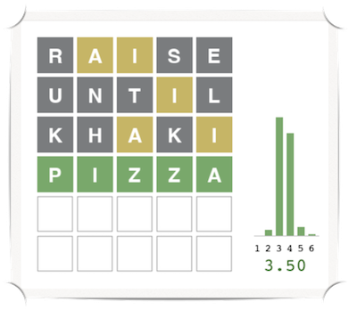

## Wordle

Expected agent has an average nunber of guesses of 3.6

To see this solver in action: python game.py -a data/allowed.txt -p data/possible.txt

We can evaluate the speed and effectiveness of this solver by running the game in evaluation mode: python game.py -a data/allowed.txt -p data/possible.txt -m histogram

This repository contains:
- `agent.py`: Recursive searching algorithms to solve the game. Includes an agent that chooses next word randomly and the one that chooses next word based on the expected number of possible words after the choice
- `game.py`: Implementation of the Wordle game.
- `graphics.py`: Graphics support for the game.
- `util.py`: Miscellaneous classes and functions.
